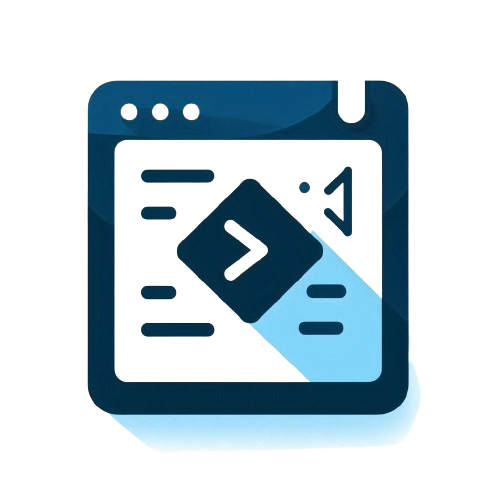

# Live Code Editor



A simple and interactive Live Code Editor built with HTML, CSS, and JavaScript. This editor allows you to write and preview your HTML, CSS, and JavaScript code in real-time, making it an excellent tool for learning and prototyping.

## Features

- **Real-time Preview:** As you write your HTML, CSS, and JavaScript code, the output is rendered instantly.
- **Responsive Layout:** The editor adjusts seamlessly across different screen sizes, providing a smooth experience on both desktop and mobile devices.
- **Easy-to-Use Interface:** Simple and clean UI design, with syntax highlighting for HTML, CSS, and JavaScript.
- **FontAwesome Integration:** Includes FontAwesome icons to enhance the visual appeal of the editor.

## Screenshots


## Getting Started

### Prerequisites

- A modern web browser
- Basic understanding of HTML, CSS, and JavaScript

### Installation

1. Clone the repository to your local machine:

   ```bash
   git clone https://github.com/yourusername/live-code-editor.git
   ```

2. Navigate to the project directory:

   ```bash
   cd live-code-editor
   ```

3. Open the `index.html` file in your preferred web browser to start using the editor.

### Files Structure

```bash
live-code-editor/
│
├── images/
│   ├── logo.png             # Favicon and project logo
│   └── screenshot.png       # Screenshot for README.md
│
├── styles.css               # Stylesheet for the editor layout and design
├── editor.js                # JavaScript functionality for live preview
└── index.html               # Main HTML file that contains the editor structure
```

### Usage

- **HTML Section:** Write your HTML code in the first textarea.
- **CSS Section:** Write your CSS code in the second textarea to style your HTML.
- **JavaScript Section:** Write your JavaScript code in the third textarea to add interactivity.

The output is automatically displayed in the right pane as you type.

### Contributing

Contributions are welcome! If you have any ideas, suggestions, or find any issues, feel free to open an issue or submit a pull request.

### License

This project is licensed under the MIT License - see the [LICENSE](LICENSE) file for details.

### Acknowledgements

- [FontAwesome](https://fontawesome.com) for providing the amazing icons.
- Inspiration from various online live code editors.

---

Feel free to customize this README to better fit your project's needs!